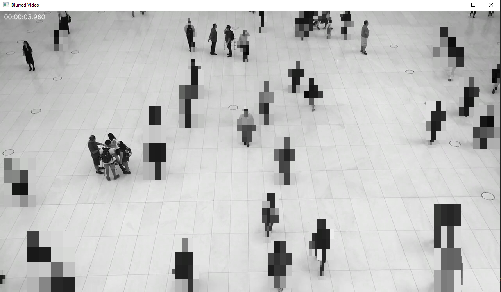

# Image Blurring Pipeline in Python

A multiprocessing video analytics pipeline that performs motion detection and selective blurring on video frames using OpenCV. The system is designed for modularity, performance, and clarity.


---
## Project Structure

```
image-blurring-pipeline/
├── pyproject.toml
├── requirements.txt
├── .pylintrc
├── data/
│   └── example.mp4               # Sample video for testing
├── docs/
│   └── README.md                 # This file
└── image_blurring_pipeline_python/
    ├── __main__.py               # Main script and CLI entry point
    ├── config/
    │   └── constants.py          # Global constants and configurations
    ├── cli/
    │   └── parse_args.py         # Argument parser for CLI usage
    ├── models/
    │   └── queue_items.py        # Queue items defined as classes
    ├── pipeline/
    │   ├── streamer.py           # Streamer process: reads and sends frames
    │   ├── detector.py           # Detector process: detects motion
    │   └── displayer.py          # Displayer process: draws detections
    └── logger/
        └── logger_manager.py     # Logger manager class and process logger setter
        

````

---

## 🚀 Installation

We recommend using a virtual environment:

```bash
python -m venv venv
source venv/bin/activate      # On Windows: venv\Scripts\activate
pip install -e .
````

This installs the package in editable mode so you can modify the source code during development.

---

## 🧪 Usage

### Run the pipeline on the sample video:

```bash
python -m image_blurring_pipeline_python
```

### Run the pipeline on a custom video:

```bash
python -m image_blurring_pipeline_python --video_path /path/to/video.mp4
```

* The `--video_path` argument can be either a relative or absolute path.

---

## How It Works

The pipeline consists of 3 independent multiprocessing components:

* **Streamer**: Reads a video frame-by-frame and sends them via a queue.
* **Detector**: Receives frames and applies motion detection.
* **Displayer**: Draws bounding boxes on the frames, adds a timestamp, applies blurring, and displays the video in real time.

An optional **Logger** process handles log messages cleanly across subprocesses.

---

## Notes
The `constants.py` file holds some configurable values like:

* `MIN_DETECTION_AREA` (int) - the minimal amount of pixel detection area to display blurring on.
* `DISPLAY_BOUNDING_BOXES` (bool) - Display bounding boxes around detections or not.
* `LOG_LEVEL` (str) - Logger logging level to display.


---

## License

MIT License. Feel free to use, modify, and contribute.

---
